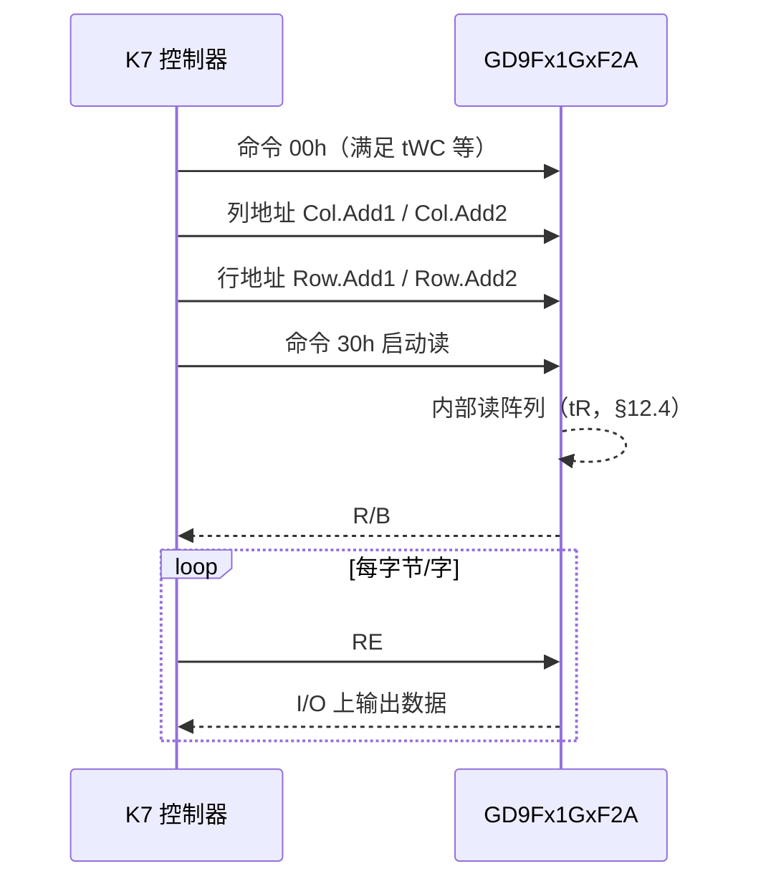
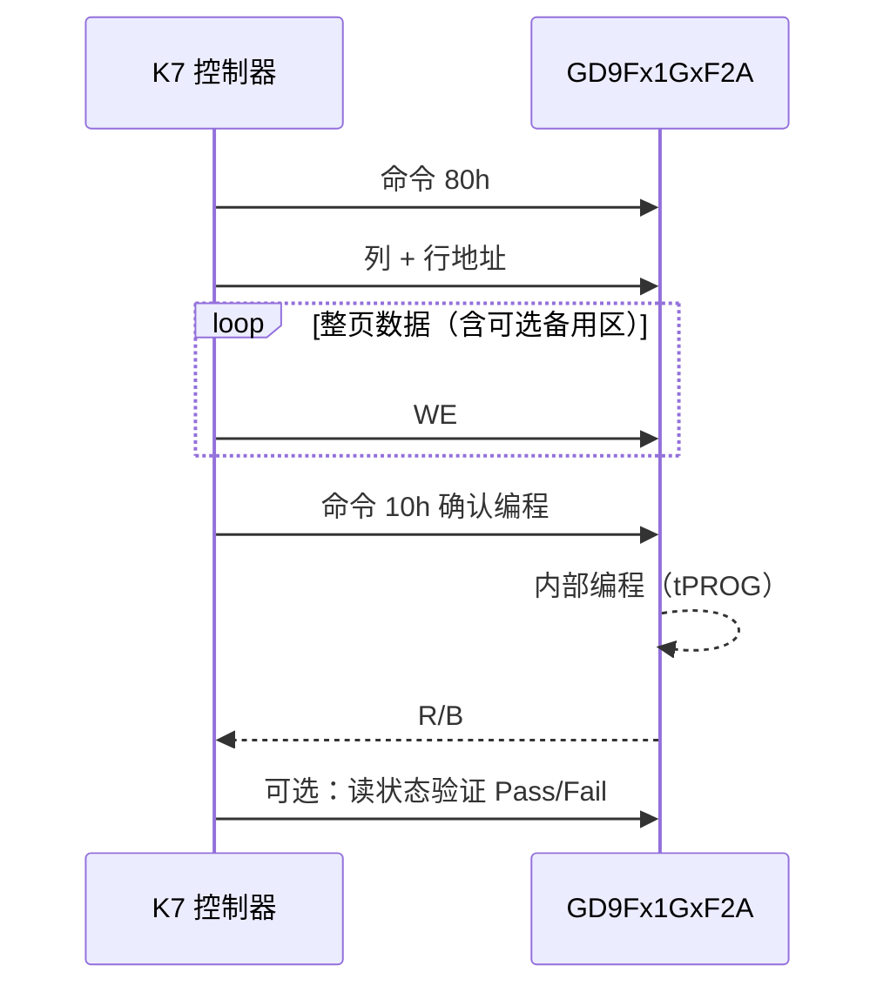
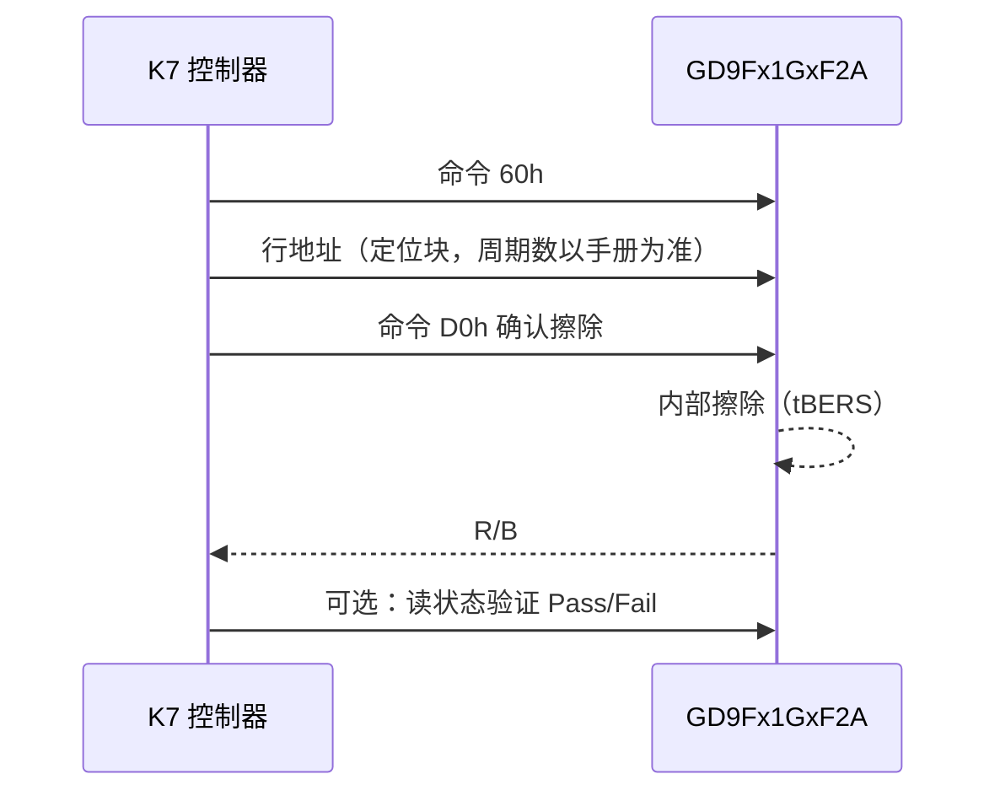

# 需求文档：兆易创新 GD9Fx1GxF2A 并口 NAND Flash 与 Xilinx Kintex-7 驱动

**文档版本**：1.2  
**编写日期**：2026-04-29  
**状态**：需求记录（待评审与细化）

**数据手册依据**：GigaDevice《**GD9Fx1GxF2A**》Datasheet（1 Gbit SLC 并口 NAND 系列文档；官网同系列单料号文件示例 **DS-00798-GD9FU1G8F2D-Rev1.1**，**Rev 与日期以官网下载为准**）。本文 **§3、§4.1** 中的电气与 AC/Performance 数值摘录自该手册 **§1 Features、§5 Array Organization、§12.3 AC Timing Characteristics、§12.4 Performance Characteristics、§8 Operation Description**。

---

## 1. 文档目的

本文档用于记录项目发起方对「在 Xilinx Kintex-7（K7）FPGA 上，驱动兆易创新并口 NAND Flash，器件系列为 **GD9Fx1GxF2A**」的需求与约束，作为后续硬件设计、RTL/软核实现、验证与集成的依据。具体型号后缀（如 `GD9FU1G8F2A`、`GD9FS1G8F2A` 等）以实际 BOM 为准，本文档以系列共性为主，差异处单独标注。

---

## 2. 项目背景与目标

- **存储器件**：兆易创新（GigaDevice）**GD9F** 系列 **1 Gbit SLC 并口 NAND Flash**，命名范式 **GD9Fx1GxF2A**（`x` 表示电压/工艺子系列，常见为 **U**：约 2.7 V～3.6 V；**S**：约 1.7 V～1.95 V）。
- **实现平台**：Xilinx **Kintex-7** FPGA（具体速度等级、封装、可用 I/O 标准以实际选型为准）。
- **总体目标**：在 K7 上实现可稳定访问该 NAND 的**驱动程序**（在 FPGA 语境下通常指 **RTL 控制器 IP**、可选 **MicroBlaze/软核固件** 或 **AXI 从接口 + 寄存器映射** 等，见第 6 节交付形态约定）。

---

## 3. 器件与协议层面的需求摘要

以下内容与 **《GD9Fx1GxF2A》数据手册** 一致处直接按手册表述；其余（如具体订货后缀、封装料号）仍以 BOM 为准。

| 项目 | 需求描述（数据手册出处） |
|------|--------------------------|
| 容量与组织 | **1 Gbit**；x8 时 **Page：2K + 128 Byte**，**Block：128K + 8K Byte**；手册概述中一页编程按 **2176 Byte**（含备用区）表述（§2 General Description）。有效块数手册 **Features** 给出 **Min 1004 / Max 1024 blocks**（以所选温度/料号为准）。 |
| 接口类型 | **异步并口 NAND**，**ONFI 1.0 Compatible**（§1 Features）。 |
| 电气 | **GD9FS**：VCC/VCCQ **1.7 V～1.95 V**；**GD9FU**：**2.7 V～3.6 V**（§1）。FPGA Bank 与 I/O 标准须与所选子系列一致。 |
| 顺序访问 / 周期 | **Random Read Time (tR)：25 μs Max**；**Sequential Access Time**：**3.3 V 器件 Min 25 ns**，**1.8 V 器件 Min 45 ns**（§1，与 §12.3 中 **tRC/tWC** 最小值对应）。 |
| 编程与擦除（典型） | **Page Program (tPROG)：300 μs Typ**；**Block Erase (tBERS)：3 ms Typ**（§1；Max 见 §4.1.3 / §12.4）。 |
| ECC | 手册 **Features** 写明 **4 bit / 512 bytes**（与 100K P/E、ECC 协同的可靠性表述一致）；控制器须按该要求连接或实现 ECC。 |
| 可靠性 / 温度 | **P/E cycles with ECC：100K**；**Data retention：10 Years**；**Industrial (I)：-40 ℃～85 ℃**，**(J)：-40 ℃～105 ℃**（§1）。 |
| 功能特性（可选需求） | **缓存读/编程**、**OTP**、**Chip Enable Don’t Care** 等（§1、§8）；是否在首版驱动中支持，见第 8 节待澄清项。 |

---

## 4. 硬件与 FPGA 侧约束

- **目标芯片**：Xilinx **Artix-7 不适用**——需求明确为 **Kintex-7**。
- **引脚与 PCB**：NAND 与 K7 之间需满足手册规定的 **建立/保持时间、负载、走线长度与信号完整性**；`R/B#`（就绪/忙）等状态信号需可靠接入（若使用上拉，阻值与 RC 延时需设计）。
- **I/O 标准**：与 NAND 电源域一致；若 NAND 为 1.8 V，则对应 FPGA Bank 必须为 **1.8 V** 供电与 **LVCMOS18**（或兼容标准），禁止混压误接。
- **时钟**：异步 NAND 由 FPGA 产生控制波形；若后续需要与系统同步，需约定系统时钟频率及是否使用 **MMCM/PLL** 产生本地采样时钟。

### 4.1 读、写、擦除时序需求

本节数值**直接对应《GD9Fx1GxF2A》数据手册 §12.3、§12.4**（异步模式）。设计须同时满足 **§7 Bus Operation** 各图中标出的 **tCLS、tWC、tRC、…** 与下表；若手册 Rev 更新，以最新版 **§12.3 / §12.4** 为准做差异对照。

**手册对读模式的补充说明（§7.4 / 图 11_b）**：若主机顺序访问周期 **tRC < 30 ns**，数据可在 **RE#** 下一下降沿以 **EDO（Extended Data Output）** 方式锁存；否则按默认数据输出时序设计。

#### 4.1.1 相关信号（与波形相关）

| 信号 | 方向（相对 NAND） | 说明 |
|------|---------------------|------|
| `I/O[7:0]` | 双向 | 命令、地址、数据复用；读时为输出，写时为输入。 |
| `CLE` / `ALE` | 输入 | 区分当前 `WE#` 周期锁存的是命令还是地址。 |
| `CE#` | 输入 | 片选；无效期间总线须处于规定电平（见手册）。 |
| `WE#` | 输入 | 写使能：命令、地址、**编程数据**在 `WE#` 边沿配合 `CLE`/`ALE` 锁存。 |
| `RE#` | 输入 | 读使能：读阵列或读状态时在 `RE#` 有效沿后数据有效。 |
| `R/B#` | 输出（开漏） | 忙为低；控制器须 **tBERS / tPROG** 量级等待或轮询状态寄存器。 |
| `WP#`（若有） | 输入 | 写保护策略见硬件设计。 |

#### 4.1.2 总线周期类 AC 时序（§12.3 AC Timing Characteristics）

下表与手册表头一致：**3.3 V** 列为 **VCC 2.7 V～3.6 V（GD9FU）**；**1.8 V** 列为 **VCC 1.7 V～1.95 V（GD9FS）**。表中 “—” 表示该列在手册中为空白（仅约束 Min 或仅约束 Max）。

| Parameter | Symbol | 3.3 V Min (ns) | 3.3 V Max (ns) | 1.8 V Min (ns) | 1.8 V Max (ns) |
|-----------|--------|----------------|----------------|----------------|----------------|
| CE# setup time | tCS | 15 | — | 15 | — |
| CE# hold time | tCH | 5 | — | 5 | — |
| CLE setup time | tCLS | 12 | — | 12 | — |
| CLE hold time | tCLH | 5 | — | 5 | — |
| ALE setup time | tALS | 12 | — | 12 | — |
| ALE hold time | tALH | 5 | — | 5 | — |
| Data setup time | tDS | 12 | — | 12 | — |
| Data hold time | tDH | 5 | — | 5 | — |
| Write cycle time | tWC | 25 | — | 45 | — |
| WE# pulse width | tWP | 12 | — | 22 | — |
| WE# high hold time | tWH | 10 | — | 15 | — |
| Address to data loading time | tADL | 70 | — | 70 | — |
| WE# high to busy | tWB | — | 100 | — | 100 |
| Ready to WE# low | tRW | 20 | — | 20 | — |
| Ready to RE# low | tRR | 20 | — | 20 | — |
| CLE to RE# delay | tCLR | 10 | — | 10 | — |
| ALE to RE# delay | tAR | 10 | — | 10 | — |
| Read cycle time | tRC | 25 | — | 45 | — |
| RE# pulse width | tRP | 12 | — | 22 | — |
| RE# high hold time | tREH | 10 | — | 15 | — |
| RE# access time | tREA | — | 20 | — | 30 |
| CE# access time | tCEA | — | 25 | — | 45 |
| RE# high to output Hi-Z | tRHZ | — | 100 | — | 100 |
| CE# high to output Hi-Z | tCHZ | — | 50 | — | 50 |
| CE# high to ALE/CLE don’t care | tCSD | 10 | — | 10 | — |
| CE# high to output hold | tCOH | 15 | — | 15 | — |
| RE# high to output hold | tRHOH | 15 | — | 15 | — |
| RE# low to output hold | tRLOH | 3 | — | 3 | — |
| Output Hi-Z to RE# low | tIR | 0 | — | 0 | — |
| CE# low to RE# low | tCR | 10 | — | 10 | — |
| RE# high to WE# low | tRHW | 100 | — | 100 | — |
| WE# high to RE# low | tWHR | 60 | — | 60 | — |
| Write protect time | tWW | 100 | — | 100 | — |

**对 K7 实现的约束**：**tWC、tRC** 取各自电压档 **Min** 作为最短合法周期；**tREA、tCEA、tWB、tRHZ、tCHZ** 等 **Max** 约束 FPGA **读采样时刻与三态窗口**；跨 **RE#→WE#**、**WE#→RE#** 切换须满足 **tRHW、tWHR**。手册 **§12.4 Note**：Typ 在 **Vcc=3.3 V、TA=25 ℃（3.3 V 器件）** 或 **Vcc=1.8 V、TA=25 ℃（1.8 V 器件）** 下测得。

#### 4.1.3 阵列操作耗时（§12.4 Performance Characteristics）

| Parameter | Symbol | Min | Typ | Max | Unit |
|-----------|--------|-----|-----|-----|------|
| Data transfer from cell to register | tR | — | — | 25 | μs |
| Program time | tPROG | — | 300 | 700 | μs |
| Read cache busy time | tCBSYR | — | 5 × tR | — | μs |
| Cache program short busy time | tCBSYW | — | 5 | 700 | μs |
| Number of partial program cycles in the same page | NOP | — | — | 4 | cycles |
| Block erase time | tBERS | — | 3 | 10 | ms |
| Device reset time (Read / Program / Erase) | tRST | — | 10 / 20 / 500 | — | μs |

**忙态处理**：页读在 **30h** 后须等待阵列到寄存器传输完成（**tR**，**R/B#** 或状态）；页编程 **10h**、块擦除 **D0h** 后须等待 **tPROG / tBERS**（同上）。可配合 **读状态 70h** 判 Ready / Pass-Fail（见 §8 各图）。**tPROG、tBERS** 的 **Max** 为控制器**超时与看门狗**的设计下限。

#### 4.1.3a 手册 §8 与波形相关的操作要点（与读写擦时序直接相关）

- **Common Page Read（00h–30h）**：手册规定与 **4 个地址周期** 及 **30h** 一起写入命令寄存器；上电后首次仅 **4 地址 + 30h** 亦可发起（§8.1.1）。选定页共 **2176 Byte** 进入数据寄存器后，由 **RE#** 以 **≥ tRC** 周期顺序读出。  
- **Page Program（80h–10h）**、**Random Data Input（85h）**、**Cache Program（80h–15h）** 等：数据输入周期须满足 **§7.3** 与上表 **tWC、tDS、tDH**。  
- **Block Erase（60h–D0h）**：行地址周期数见 **§5 / §8.3**（与 x8、寻址方案一致）。  
- **WP#**：擦除/编程在 **WP#** 拉低时被禁止；手册 **§7.5** 给出 **tWW** 与编程/擦除命令边沿关系。

#### 4.1.4 操作流程级时序（命令序列，与 §8 波形对应）

以下为手册 **§8** 描述的 **常用单平面操作** 逻辑顺序；实现时每一步之间的 **总线边沿** 须满足 **§4.1.2**，**阵列忙等待** 须满足 **§4.1.3**。

**页读（Common Page Read：00h + 4 地址周期 + 30h，见 §8.1.1、图 13）**

**页编程（典型：80h + 地址 + 页数据写入 + 10h）**

**块擦除（典型：60h + 行地址（块）+ D0h）**

#### 4.1.5 需求文档对验证的附加要求

- 仿真或 ILA 抓取波形时，须能核对 **`WE#`/`RE#` 周期** 不小于手册 **tWC min / tRC min**，以及 **ALE/CLE/数据** 相对 `WE#` 的建立保持时间。  
- 须在测试用例中覆盖 **tPROG、tBERS** 量级的等待（或模型加速仿真 + 单独长超时测试），确保状态机不会因过短超时误判失败。

---

## 5. 驱动功能需求

### 5.1 必选能力

1. **器件识别与初始化**  
   - 上电或复位后的合理初始化序列（含复位、读 ID、可选参数页读取等，以手册为准）。  
   - 能区分/配置所选 **GD9Fx1GxF2A** 子型号的关键参数（页大小、块大小、列/行地址周期数等）。

2. **基本数据通路**  
   - **页读**：按页从阵列读出数据（含或不含备用区由需求决定）。  
   - **页编程**：按页写入。  
   - **块擦除**：按块擦除。  
   - 支持 **忙等待**（轮询 `R/B#` 或状态寄存器），避免违反 tPROG、tBERS 等时间要求。

3. **坏块与可靠性（最低要求）**  
   - 遵守厂商对**出厂坏块**的标记与处理建议。  
   - 预留 **ECC** 处理接口或说明：SLC NAND 常需 **4 bit/8 bit ECC**（具体以手册与系统错误率目标为准）；需明确 ECC 由 **FPGA 硬核/软 IP** 还是 **外部处理器** 完成。

4. **主机侧接口**  
   - 与上层系统对接方式需实现其一或组合（在详细设计中冻结）：  
     - **AXI4-Lite** 寄存器控制 + **AXI-Stream / AXI4** 数据搬运；或  
     - **FIFO + 简单本地总线**；或  
     - **MicroBlaze** 软件驱动 + EMIO/自定义外设。

### 5.2 可选增强（按优先级另列）

- **缓存读/缓存编程** 以提高吞吐。  
- **多片选/多片 NAND** 扩展容量。  
- **坏块表（BBT）** 管理与磨损均衡策略（若由软核实现）。  
- **安全特性**：OTP 读写、写保护引脚策略等。

---

## 6. 交付形态约定（“驱动程序”范围）

请在详细设计阶段将下列之一标为**必选交付**：

| 形态 | 说明 |
|------|------|
| A. 纯 RTL IP | Verilog/VHDL NAND 控制器，含仿真模型对接或 testbench。 |
| B. RTL + Vivado 工程 | 可综合、可例化到 Block Design，含约束模板（XDC）。 |
| C. 软核 + 软件 | MicroBlize 等 + C 驱动（初始化、读页、写页、擦除 API）。 |

**验证需求（建议写入合同级需求）**：至少包含仿真用 **NAND 行为/时序模型**、关键命令路径波形检查，以及（若条件允许）硬件在环最小用例（读 ID、单页读写、单块擦除）。

---

## 7. 非功能需求

- **可维护性**：模块划分清晰（命令译码、时序 FSM、数据通路、ECC 接口）；关键参数（页长、地址周期数）可配置。  
- **可移植性**：尽量与具体 K7 子型号解耦，差异集中在 XDC 与顶层例化。  
- **资源与时序**：在目标 K7 速度与温度等级下满足时序收敛；给出大致 LUT/FF/BRAM 占用预期（在实现后回填）。  
- **文档**：用户指南（寄存器说明、操作流程、已知限制）、集成说明（引脚连接、电平、上拉）。

---

## 8. 待澄清项（需项目方与硬件工程师确认）

1. **确切料号**：`GD9Fx1GxF2A` 中 `x` 与完整订货型号（封装 TSOP48 / FBGA 等）。  
2. **页/块几何**：本需求 **§3** 已与手册 **2K+128 Byte / 128K+8K Byte（x8）** 对齐；若 BOM 为 **x16（GD9Fx1G6F2A）** 或其它封装后缀，以手册 **§2.1 Product List、§5** 为准做一次核对并更新实现常量。  
3. **ECC 方案**：手册要求 **4 bit / 512 bytes**（§1）；须明确在 FPGA 内 **BCH/汉明** 等实现或与软核分工。  
4. **主机接口**：AXI、自定义总线或软核。  
5. **性能指标**：连续读/写带宽、随机读延迟上限。  
6. **是否首版即支持多平面/缓存模式/ONFi 参数页** 等高级特性。  
7. **数据手册 Rev**：若升级 **DS-00798-*** 或封面 **Rev**，须对 **§12.3、§12.4、§8** 做勘误对照并更新本需求文档版本号。  
8. **EDO 模式**：是否实现 **tRC < 30 ns** 的 EDO 读（§7.4）；默认可实现 **tRC ≥ 手册 Min** 的标准读。

---

## 9. 参考资料（外部）

- 兆易创新 **Parallel NAND Flash** 产品索引：<https://www.gigadevice.com.cn/product/flash/parallel-nand-flash>  
- 同系列 **1 Gbit / 3 V / x8** 产品页（含数据手册条目 **DS-00798-GD9FU1G8F2D-Rev1.1**）：<https://www.gigadevice.com.cn/product/flash/parallel-nand-flash/gd9fu1g8f2d>  
- 数据手册标题：**GD9Fx1GxF2A Datasheet**（与上述 **DS-00798-*** 为同一系列技术内容；**以下载 PDF 为准**）。  
- Xilinx **Kintex-7** 数据手册、UG472 等 SelectIO 与时序相关文档（以实际 Vivado 版本为准）。  
- **ONFI 1.0**（器件声明兼容版本，见手册 §1）。

---

## 10. 修订记录

| 版本 | 日期 | 说明 |
|------|------|------|
| 1.0 | 2026-04-29 | 初稿：记录需求与待澄清项 |
| 1.1 | 2026-04-29 | 补充读/写总线时序（tRC、tWC 等）、页编程与块擦除耗时（tPROG、tBERS）及操作流程级时序说明与验证要求 |
| 1.2 | 2026-04-29 | 按《GD9Fx1GxF2A》数据手册 §12.3/§12.4 填入完整 AC 与 Performance 表；§3、§4.1 与 §8/§1 对齐并补充官网手册引用 |
