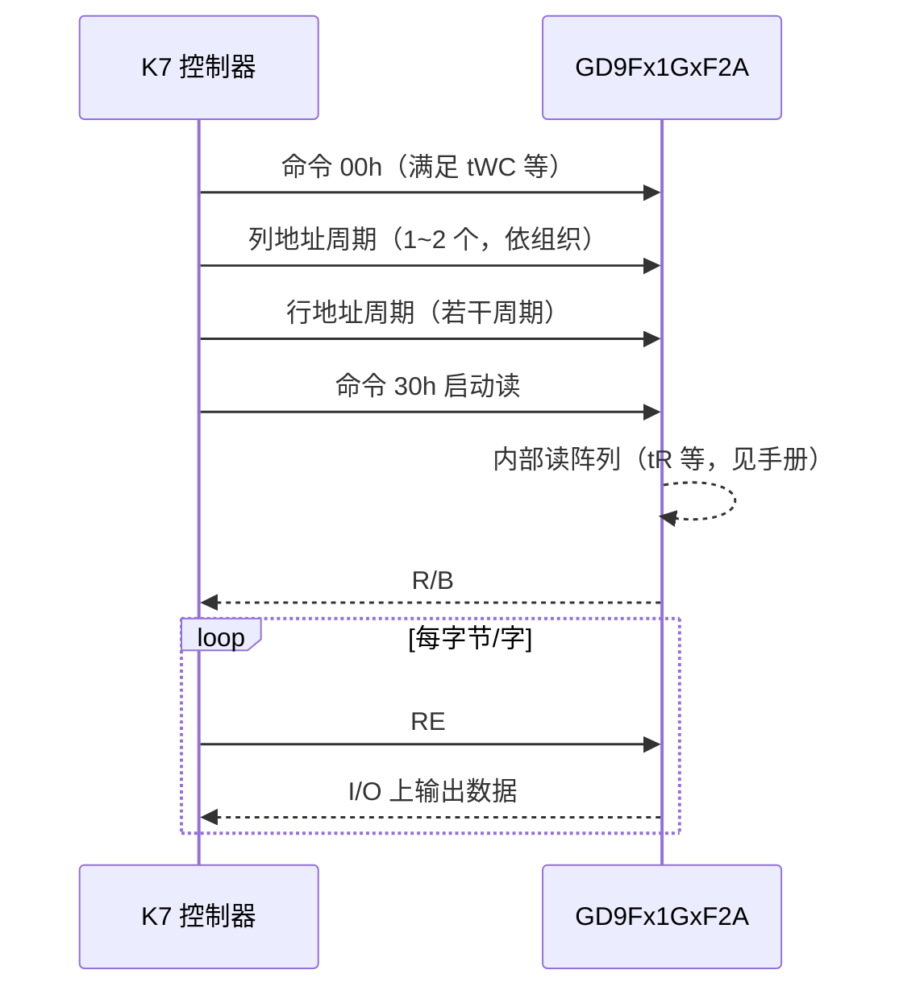
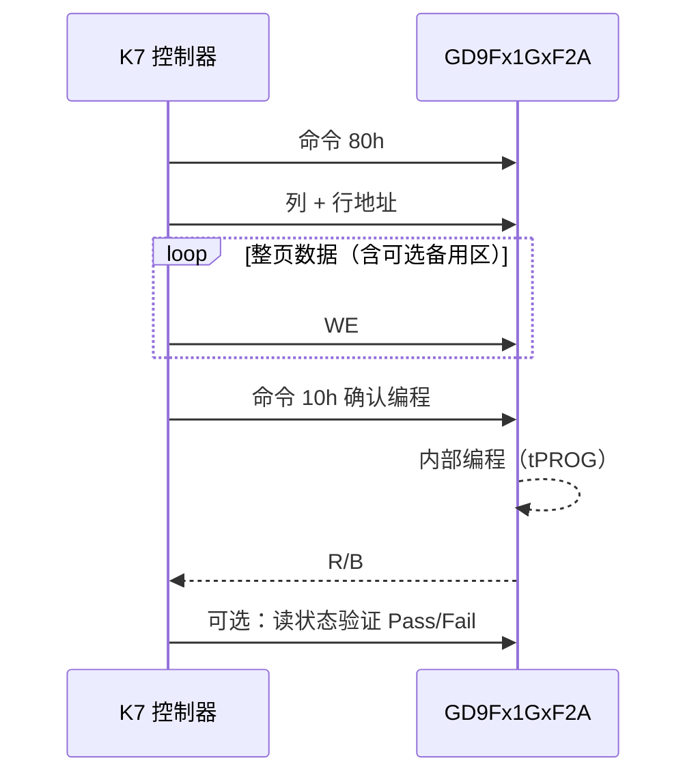
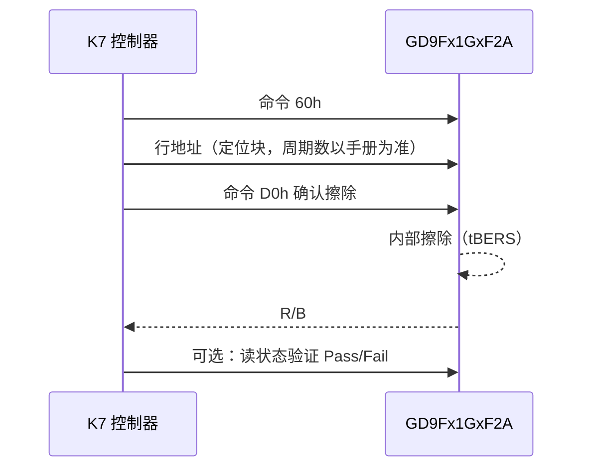

# 需求文档：兆易创新 GD9Fx1GxF2A 并口 NAND Flash 与 Xilinx Kintex-7 驱动

**文档版本**：1.1  
**编写日期**：2026-04-29  
**状态**：需求记录（待评审与细化）

---

## 1. 文档目的

本文档用于记录项目发起方对「在 Xilinx Kintex-7（K7）FPGA 上，驱动兆易创新并口 NAND Flash，器件系列为 **GD9Fx1GxF2A**」的需求与约束，作为后续硬件设计、RTL/软核实现、验证与集成的依据。具体型号后缀（如 `GD9FU1G8F2A`、`GD9FS1G8F2A` 等）以实际 BOM 为准，本文档以系列共性为主，差异处单独标注。

---

## 2. 项目背景与目标

- **存储器件**：兆易创新（GigaDevice）**GD9F** 系列 **1 Gbit SLC 并口 NAND Flash**，命名范式 **GD9Fx1GxF2A**（`x` 表示电压/工艺子系列，常见为 **U**：约 2.7 V～3.6 V；**S**：约 1.7 V～1.95 V）。
- **实现平台**：Xilinx **Kintex-7** FPGA（具体速度等级、封装、可用 I/O 标准以实际选型为准）。
- **总体目标**：在 K7 上实现可稳定访问该 NAND 的**驱动程序**（在 FPGA 语境下通常指 **RTL 控制器 IP**、可选 **MicroBlaze/软核固件** 或 **AXI 从接口 + 寄存器映射** 等，见第 6 节交付形态约定）。

---

## 3. 器件与协议层面的需求摘要

以下内容综合公开资料与系列说明，**精确时序、命令集细节、坏块策略、ECC 位宽等须以官方数据手册为准**（建议引用 GigaDevice 发布的 **GD9Fx1GxF2A** 系列 Datasheet）。

| 项目 | 需求描述 |
|------|----------|
| 容量与组织 | 典型为 **1 Gbit**，常见组织为 **128M × 8**（x8 总线）；系列说明中常见 **2K + 64 B** 或 **2K + 128 B** 页结构（含备用区），块大小需对照具体型号数据手册。 |
| 接口类型 | **异步并口 NAND**（地址/命令/数据复用 I/O），兼容业界常用的 **ONFi** 类时序与命令习惯（具体 ONFi 版本以手册为准）。 |
| 电气 | 子系列分 **3.0 V 档** 与 **1.8 V 档**；FPGA Bank 电压、I/O 标准（如 LVCMOS33 / LVCMOS18）必须与所选料号一致。 |
| 可靠性指标（系列级） | 典型 **100k** 次编程/擦除周期、**10 年**级数据保留（工业温区常见 **-40 ℃～+85 ℃**，以所选料号为准）。 |
| 功能特性（可选需求） | 系列支持 **缓存读/编程**、**OTP/UID/阵列保护** 等；是否在首版驱动中支持，见第 8 节待澄清项。 |

---

## 4. 硬件与 FPGA 侧约束

- **目标芯片**：Xilinx **Artix-7 不适用**——需求明确为 **Kintex-7**。
- **引脚与 PCB**：NAND 与 K7 之间需满足手册规定的 **建立/保持时间、负载、走线长度与信号完整性**；`R/B#`（就绪/忙）等状态信号需可靠接入（若使用上拉，阻值与 RC 延时需设计）。
- **I/O 标准**：与 NAND 电源域一致；若 NAND 为 1.8 V，则对应 FPGA Bank 必须为 **1.8 V** 供电与 **LVCMOS18**（或兼容标准），禁止混压误接。
- **时钟**：异步 NAND 由 FPGA 产生控制波形；若后续需要与系统同步，需约定系统时钟频率及是否使用 **MMCM/PLL** 产生本地采样时钟。

### 4.1 读、写、擦除时序需求

本节规定控制器在 **异步并口** 模式下须满足的**总线周期时序**与**阵列操作耗时**，用于 RTL 状态机、超时计数器及 XDC 输入/输出延时的设计依据。**各参数的最小值/最大值以所选料号官方数据手册的 AC Timing / Performance 表为准**；下表为 **GD9Fx1GxF2A** 系列公开资料中常见的**典型量级**（不同电压档 `U`/`S`、温度与工艺角可能不同）。

#### 4.1.1 相关信号（与波形相关）

| 信号 | 方向（相对 NAND） | 说明 |
|------|---------------------|------|
| `I/O[7:0]` | 双向 | 命令、地址、数据复用；读时为输出，写时为输入。 |
| `CLE` / `ALE` | 输入 | 区分当前 `WE#` 周期锁存的是命令还是地址。 |
| `CE#` | 输入 | 片选；无效期间总线须处于规定电平（见手册）。 |
| `WE#` | 输入 | 写使能：命令、地址、**编程数据**在 `WE#` 边沿配合 `CLE`/`ALE` 锁存。 |
| `RE#` | 输入 | 读使能：读阵列或读状态时在 `RE#` 有效沿后数据有效。 |
| `R/B#` | 输出（开漏） | 忙为低；控制器须 **tBERS / tPROG** 量级等待或轮询状态寄存器。 |
| `WP#`（若有） | 输入 | 写保护策略见硬件设计。 |

#### 4.1.2 总线周期类 AC 时序（命令 / 地址 / 读数据）

以下名称与 ONFi / 常见 NAND 数据手册一致；除 **tRC / tWC** 外，**tCLS、tALS、tDS、tDH、tCLH、tALH、tRP、tREH、RE# 高电平宽度** 等须全部满足手册 **AC Characteristics** 表（含最小、最大列）。

| 参数 | 含义 | 需求说明（设计须满足） |
|------|------|------------------------|
| **tWC** | `WE#` 写周期时间 | 连续命令/地址/数据写入时，相邻有效 `WE#` 周期 ≥ 手册 **tWC min**；系列资料常见标称约 **25 ns～45 ns**（**3.0 V 档**与 **1.8 V 档**可能不同，**1.8 V 档往往要求更长周期**）。 |
| **tRC** | `RE#` 读周期时间 | 从阵列或状态寄存器读字节时，相邻 `RE#` 有效周期 ≥ 手册 **tRC min**；系列资料常见与 **tWC** 同量级（约 **25 ns～45 ns**，以电压档与手册为准）。 |
| 建立/保持 | `CLE`/`ALE` 相对 `WE#`、数据相对 `WE#` | 满足 **tCLS、tALS、tDS、tDH、…** 等，避免亚稳或误锁存。 |

**对 K7 实现的约束**：FPGA 输出到 NAND 的走线延迟与翻转率须纳入 margin；若使用较高系统时钟分频产生 `WE#`/`RE#`，**周期计数须按手册 worst-case（最大 tRC/tWC 或最慢角）** 取值，并在仿真中与 NAND 模型核对。

#### 4.1.3 阵列操作耗时（页编程与块擦除）

| 参数 | 含义 | 典型需求（系列公开值，以手册 Max 为超时依据） |
|------|------|-----------------------------------------------|
| **tPROG** | 页编程时间（`10h` 等完成编程至 `R/B#` 就绪） | 公开资料常见 **Typ 300 μs，Max 700 μs**（页大小含备用区时仍以此类量级为参考）。控制器 **超时阈值须 ≥ 手册给出的 tPROG Max**，并保留系统裕量。 |
| **tBERS** | 块擦除时间（擦除命令至 `R/B#` 就绪） | 公开资料常见 **Typ 3 ms，Max 10 ms**。控制器 **超时阈值须 ≥ 手册 tBERS Max**，并保留裕量。 |

**忙态处理**：在发出会触发内部算法的命令后，须等待 **`R/B#` 变高** 或按手册通过 **读状态命令（如 `70h`）** 判断 **Ready**，禁止在忙期内发送非法总线序列。

#### 4.1.4 操作流程级时序（命令序列，与波形对应）

以下为 **常用单平面操作** 的逻辑顺序（具体命令码与地址周期数以数据手册为准）；实现时每一步之间的 **总线周期** 须满足 4.1.2 节，**编程/擦除结束等待** 须满足 4.1.3 节。

**页读（典型：00h + 列地址 + 行地址 + 30h）**

**页编程（典型：80h + 地址 + 页数据写入 + 10h）**

**块擦除（典型：60h + 行地址（块）+ D0h）**

#### 4.1.5 需求文档对验证的附加要求

- 仿真或 ILA 抓取波形时，须能核对 **`WE#`/`RE#` 周期** 不小于手册 **tWC min / tRC min**，以及 **ALE/CLE/数据** 相对 `WE#` 的建立保持时间。  
- 须在测试用例中覆盖 **tPROG、tBERS** 量级的等待（或模型加速仿真 + 单独长超时测试），确保状态机不会因过短超时误判失败。

---

## 5. 驱动功能需求

### 5.1 必选能力

1. **器件识别与初始化**  
   - 上电或复位后的合理初始化序列（含复位、读 ID、可选参数页读取等，以手册为准）。  
   - 能区分/配置所选 **GD9Fx1GxF2A** 子型号的关键参数（页大小、块大小、列/行地址周期数等）。

2. **基本数据通路**  
   - **页读**：按页从阵列读出数据（含或不含备用区由需求决定）。  
   - **页编程**：按页写入。  
   - **块擦除**：按块擦除。  
   - 支持 **忙等待**（轮询 `R/B#` 或状态寄存器），避免违反 tPROG、tBERS 等时间要求。

3. **坏块与可靠性（最低要求）**  
   - 遵守厂商对**出厂坏块**的标记与处理建议。  
   - 预留 **ECC** 处理接口或说明：SLC NAND 常需 **4 bit/8 bit ECC**（具体以手册与系统错误率目标为准）；需明确 ECC 由 **FPGA 硬核/软 IP** 还是 **外部处理器** 完成。

4. **主机侧接口**  
   - 与上层系统对接方式需实现其一或组合（在详细设计中冻结）：  
     - **AXI4-Lite** 寄存器控制 + **AXI-Stream / AXI4** 数据搬运；或  
     - **FIFO + 简单本地总线**；或  
     - **MicroBlaze** 软件驱动 + EMIO/自定义外设。

### 5.2 可选增强（按优先级另列）

- **缓存读/缓存编程** 以提高吞吐。  
- **多片选/多片 NAND** 扩展容量。  
- **坏块表（BBT）** 管理与磨损均衡策略（若由软核实现）。  
- **安全特性**：OTP 读写、写保护引脚策略等。

---

## 6. 交付形态约定（“驱动程序”范围）

请在详细设计阶段将下列之一标为**必选交付**：

| 形态 | 说明 |
|------|------|
| A. 纯 RTL IP | Verilog/VHDL NAND 控制器，含仿真模型对接或 testbench。 |
| B. RTL + Vivado 工程 | 可综合、可例化到 Block Design，含约束模板（XDC）。 |
| C. 软核 + 软件 | MicroBlize 等 + C 驱动（初始化、读页、写页、擦除 API）。 |

**验证需求（建议写入合同级需求）**：至少包含仿真用 **NAND 行为/时序模型**、关键命令路径波形检查，以及（若条件允许）硬件在环最小用例（读 ID、单页读写、单块擦除）。

---

## 7. 非功能需求

- **可维护性**：模块划分清晰（命令译码、时序 FSM、数据通路、ECC 接口）；关键参数（页长、地址周期数）可配置。  
- **可移植性**：尽量与具体 K7 子型号解耦，差异集中在 XDC 与顶层例化。  
- **资源与时序**：在目标 K7 速度与温度等级下满足时序收敛；给出大致 LUT/FF/BRAM 占用预期（在实现后回填）。  
- **文档**：用户指南（寄存器说明、操作流程、已知限制）、集成说明（引脚连接、电平、上拉）。

---

## 8. 待澄清项（需项目方与硬件工程师确认）

1. **确切料号**：`GD9Fx1GxF2A` 中 `x` 与完整订货型号（封装 TSOP48 / FBGA 等）。  
2. **页/块几何**：2K+64 还是 2K+128、每块页数、有效块数。  
3. **ECC 方案**：位宽、算法（BCH 等）、在 FPGA 内还是 CPU 内实现。  
4. **主机接口**：AXI、自定义总线或软核。  
5. **性能指标**：连续读/写带宽、随机读延迟上限。  
6. **是否首版即支持多平面/缓存模式/ONFi 参数页** 等高级特性。  
7. **AC 表最终数值**：以锁定的 PDF 版本为准，将 **tRC、tWC、tPROG、tBERS** 及所有 **tXXX min/max** 填入本文件 4.1 节表格作为验收基线。

---

## 9. 参考资料（外部）

- 兆易创新官网 **Parallel NAND Flash** 产品页及 **GD9F** 系列数据手册下载。  
- Xilinx **Kintex-7** 数据手册、UG472 等 SelectIO 与时序相关文档（以实际 Vivado 版本为准）。  
- ONFi 规范（若项目声明需严格 ONFi 认证，需明确版本号）。

---

## 10. 修订记录

| 版本 | 日期 | 说明 |
|------|------|------|
| 1.0 | 2026-04-29 | 初稿：记录需求与待澄清项 |
| 1.1 | 2026-04-29 | 补充读/写总线时序（tRC、tWC 等）、页编程与块擦除耗时（tPROG、tBERS）及操作流程级时序说明与验证要求 |
